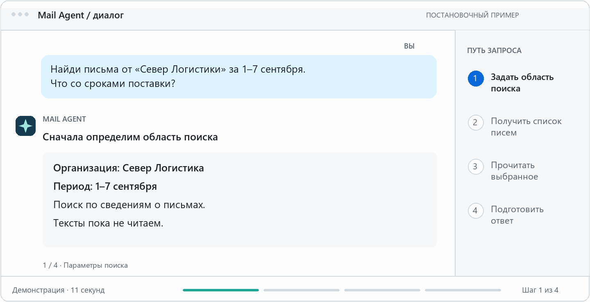
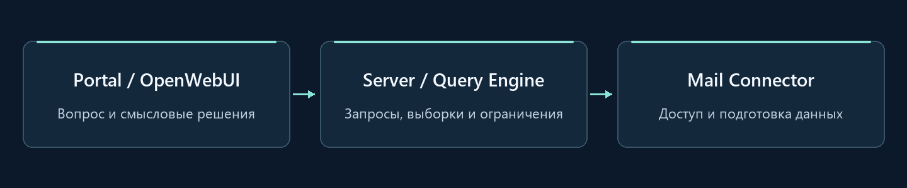
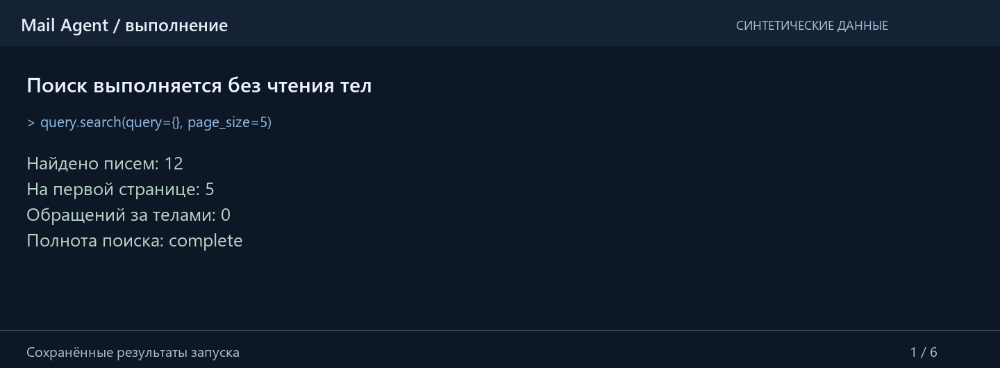

<p align="center">
  
</p>

<p align="center"><strong>Python 3.11+ · FastAPI · Демо без ключей · Синтетические данные</strong></p>

<p align="center"><a href="#сценарий">Посмотреть сценарий</a> · <a href="#попробовать">Запустить демо</a> · <a href="#архитектура">Как устроено</a></p>

> **Showcase Edition.** Открытая демонстрация проекта: выбранный оригинальный код и исполняемые адаптеры на синтетических данных. Внутренние алгоритмы продукта остаются закрытыми.

## Переписка накапливается. Вопросы остаются конкретными.

Чтобы ответить клиенту, нужно восстановить договорённости: кто что обещал, какой срок изменился и в каком письме это подтверждено.

> «Найди письма от “Север Логистики” за неделю. Что они писали о сроках поставки?»

| 01 · Сузить переписку | 02 · Выбрать нужное | 03 · Дать модели контекст |
| :--- | :--- | :--- |
| Задать организацию, участников и период. Получить список писем без чтения всего ящика. | Просмотреть фрагменты и прочитать письма, которые относятся к вопросу. | Передать подготовленные тексты и источники. Модель портала разбирает содержание. |

<a name="сценарий"></a>




## Инженерные решения

### Дать AI инструменты для исследования переписки

Модель задаёт людей, организации, группы и даты через `mail_search`, получает страницы результатов, просматривает фрагменты и запрашивает выбранные тексты через `mail_read`. Каждый шаг продолжает работу с сохранённой выборкой.

**Параметры поиска → Сохранённая выборка → Короткий просмотр → Выбранные тексты**

Сервер проверяет параметры и исполняет запросы. Вопросы о смысле — например, о договорённостях или сроках — модель разбирает по найденным текстам.

| Решение | Что это даёт |
| :--- | :--- |
| **Подготовленный контекст** | В портал поступают текст письма, нужные сведения об источнике и предупреждения. Сырой MIME, служебные почтовые идентификаторы и громоздкая JSON-обвязка не занимают контекст модели. |
| **Полноценный цикл запросов** | Поиск создаёт выборку. Следующие страницы и чтение ссылаются на неё; сервер проверяет параметры и ссылки на результаты. |
| **Контроль объёма и полноты** | Сначала сведения о письмах, затем фрагменты и выбранные тексты. Если данных не хватает или текст усечён, это видно в выдаче. |
| **Контроль действий** | Каждое предложение требует отдельного решения человека. Повторное подтверждение завершённого действия возвращает сохранённый результат. |

**Сложная реализация остаётся внутри продукта.** Сопоставление участников переписки, ранжирование, разбор форматов писем и защищённое хранение описаны на уровне ответственности. В showcase закрытые движки заменены упрощёнными исполняемыми адаптерами. [Состав и происхождение кода →](docs/PROVENANCE.md)

## Проактивность, почтовые действия и Bitrix24

Найти договорённость — начало работы. Следом нужно ответить, передать вопрос коллеге или поставить задачу. Новое письмо становится поводом предложить следующее действие.

| Почта | Bitrix24 | Проактивность |
| :--- | :--- | :--- |
| Черновик, отправка, ответ, пересылка, отметка о прочтении и перемещение письма. | Поиск контакта и создание связанной с ним задачи. | По входящему событию — предложения ответа и CRM-задачи. Каждое подтверждается отдельно. |

**Новое письмо → Контакт в Bitrix24 → Предложения → Подтверждение → Действия**

**Удаление писем исключено.**

Демонстрация использует синтетические почтовый и CRM-коннекторы. События подаются через API, предложения формирует заданная политика, эффекты сохраняются в памяти сессии. Базовое почтовое ядро работает на чтение; действия вынесены в отдельный слой.

[Коннектор Bitrix24](bitrix_connector/synthetic.py) · [Проактивность](server/proactive.py) · [Подтверждения и действия](server/actions.py)

## Архитектура



Сервер отвечает за поиск и чтение. В контекст портала поступает подготовленная выдача. В открытой сборке роль модели заменяет фиксированная политика, чтобы сценарий работал без API-ключей.

[Архитектура подробнее](docs/ARCHITECTURE.md) · [Карта возможностей](docs/FEATURES.md) · [Происхождение кода](docs/PROVENANCE.md)

## Настоящий запуск сборки

Сохранённые результаты выполнения на синтетических данных: конкретные запросы, ограничения и последствия подтверждения действий.



*Записанные результаты запуска; код не выполняется в браузере. [Итог без анимации](docs/assets/showcase-run-still.png) · [Данные записи и SHA исходников](docs/DEMO_RECORDING.json) · [CLI-сценарий](demo.py).*

## Попробовать

Python **3.11+**. Из корня репозитория:

```sh
python -m venv .venv
```

Активация: Windows PowerShell — `.\.venv\Scripts\Activate.ps1`; Linux/macOS — `source .venv/bin/activate`.

```sh
python -m pip install -r requirements.txt
python demo.py --interactive
```

После установки CLI работает без сети и доступа к вашей почте.

[Инструкция запуска, HTTP API и тесты →](docs/RUNNING.md)

<details>
<summary>Границы демонстрации</summary>

Синтетические письма и CRM, упрощённые адаптеры, состояние в памяти сессии. Предложения формирует фиксированная политика; каждое подтверждается отдельно. Удаления писем нет.

Это локальная демонстрация без production-аутентификации и реальных почтовых учётных данных. Закрытые алгоритмы, инфраструктура и настройки развёртывания в публичную сборку не входят.

[Условия публикации](NOTICE.md)

</details>

---

[](https://t.me/mia_ops)
