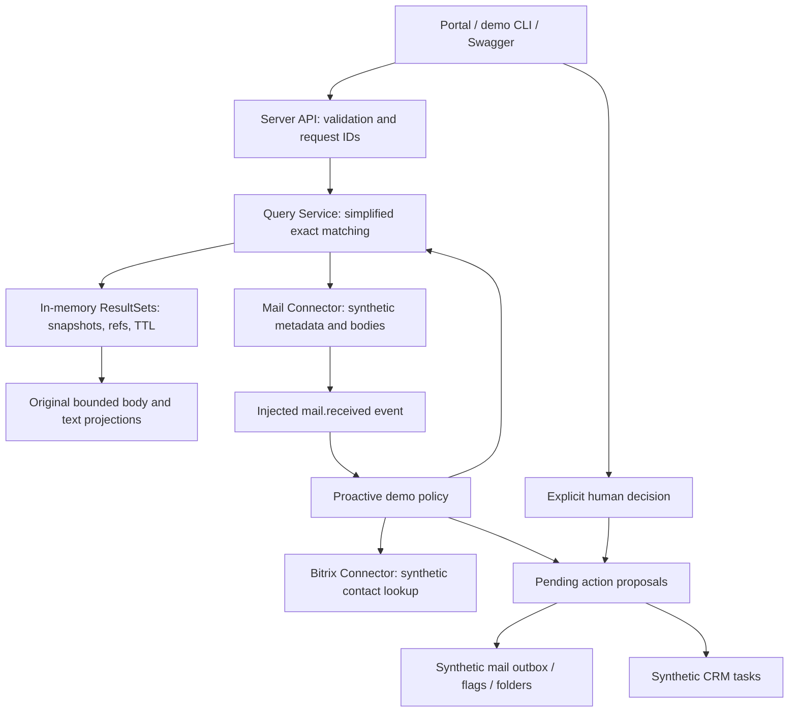

# Architecture and deliberate substitutions

## Layer ownership

The mail connector owns transport-level data and operations. It does not choose
when to reply or create a CRM task. The server owns the application workflow,
query snapshots and proposal decisions. The Bitrix connector owns the CRM port.
The portal would normally own semantic reasoning; this demo substitutes a fixed
policy so no model, API key or production prompt is needed.

Receiving mail is represented by delivery of a fixture event. A real IMAP
subscription/poller would belong to an adapter, with events consumed by server
policy. Reply, forward, send, draft, read flags and folder changes are connector
operations coordinated by the server. No delete operation exists.

The fixed proactive policy does not read instructions from message bodies. It
uses a known fixture sender, proposes a prepared acknowledgement, looks up a
synthetic CRM contact, and proposes a follow-up task. Bitrix24 is represented by
`CrmPort`, not a partial real REST client. Actual Bitrix fields, API mappings and
authentication are deliberately not invented here.

## Query substitution

`MailQuerySpecV2`, search/read DTOs and presentation code originate in the original
project. `QueryService` is a new small implementation. It compares names/emails by
casefolded equality across From/To/Cc and sorts newest first. It does not include
the original normalization, domain inference, token repair, scoring or ranking.
The `banks` group maps to one fictitious address. Attention is a fixed fixture
annotation, not the original ruleset or a model judgment.

Snapshots retain selected metadata, evidence and refs in memory. Repeated pages
reuse the same snapshot; body reads are separate and individually bounded.
Original DTO limits that appear in source are intentionally public. Demo service
budgets are independent illustrative constants. Missing/oversized bodies are
rejected before synthetic fetch and coverage explains partial results.

## Actions and failure semantics

Proposal payloads are copied into a server-side record. The decision endpoint
accepts only a boolean, so approval cannot replace the destination or body.
The record is checked against the demo session, deadline and source snapshot.
Repeated approval of a completed action returns its recorded result. Rejection
is terminal. A synthetic CRM failure occurs before writing; the reviewer can retry.

This is process-local deduplication, not distributed exactly-once delivery.
There is no durable outbox, transaction spanning mail/CRM, lease recovery or
compensating action. Restart discards all state. Production implementations of
those mechanisms are outside the public code.

The API uses a single fail-fast lock to serialize mutations and bound concurrent
work. That is a teaching substitute, not the production executor. Fixed demo
sessions deliberately provide no real identity verification. Fault controls are
human-operated demo endpoints, not model tools.

## Publication boundary

The showcase is assembled from an allowlist; it never imports parent source.
The original IMAP parser, engines, storage, deployment scripts and operational
notes are absent. The public contracts necessarily expose some design decisions;
the code included here is intentionally available for inspection and copying
under the applicable publication terms. It cannot protect the underlying ideas
from independent reimplementation.
